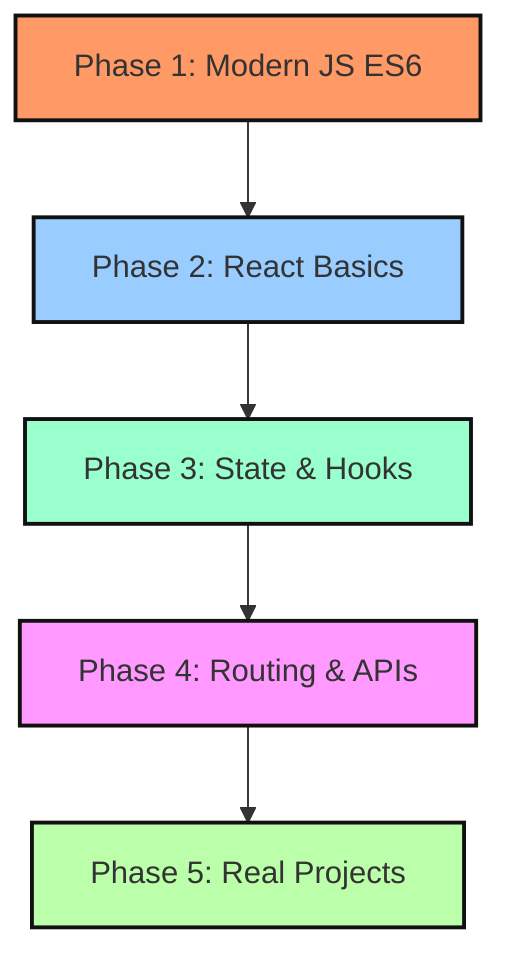

# Wesly's Guide: Transitioning from HTML/CSS to React JS

Welcome! As a Computer Science student with a foundation in HTML, CSS, and basic JavaScript, transitioning to React is one of the most exciting and powerful steps you can take. 

This guide breaks down exactly how your new React + Vite CV app works under the hood, explains core React concepts simply, and provides a clear, step-by-step learning roadmap to help you master React.

---

## 1. The Core Paradigm Shift

In traditional web development, you build sites **imperatively** (manually giving instructions). In React, you build sites **declaratively** (stating what the UI should look like based on the current data).

| Concept | Traditional Static Web | React JS Web |
| :--- | :--- | :--- |
| **Pages** | Multiple separate HTML files (`about.html`, `skills.html`). Clicking links triggers a slow browser reload. | **Single Page Application (SPA)**. A single `index.html` file. React dynamically swaps page sections in and out instantly. |
| **DOM Manipulation** | Manually selecting elements: `document.getElementById('typing')` and changing their text. | **State Driven**. You define a variable (State). When the state changes, React updates the screen automatically. |
| **File Structure** | Separate HTML, CSS, and JS files per page. | **Component-Driven**. HTML structure and Javascript logic are bundled together in single modular files called `.jsx` files. |

---

## 2. How Your CV App Works Under the Hood

Here is the exact journey of how your browser loads and runs your new CV portfolio:

### The Build Tool: Vite ⚡
Traditional React setups can be slow. **Vite** is a modern build tool that compiles your JSX files, styles, and assets into static code in milliseconds. It provides **Hot Module Replacement (HMR)**—the moment you hit Save in your editor, Vite pushes only the modified component directly to your open browser tab without a full reload.

### The Entry Point
1. **`index.html` (The Container)**: The browser loads a single `index.html`. It contains a blank canvas:
   ```html
   <div id="root"></div>
   ```
2. **`src/main.jsx` (The Link)**: This script connects your React code to the HTML. It grabs that `root` div and mounts your React application inside it:
   ```javascript
   ReactDOM.createRoot(document.getElementById('root')).render(<App />)
   ```
3. **`src/App.jsx` (The Coordinator)**: This is the parent shell component. It keeps track of which tab is open (`home`, `about`, `skills`, `experience`, `data-analytics`, or `contact`) and displays the correct child component based on that tab.

---

## 3. The 4 Core React Concepts You Need to Know

React rests on four major building blocks. Let's look at how they are used in your CV app:

### A. Components (Modular Bricks)
Components are reusable JavaScript functions that return HTML-like code called **JSX**. 
* Every component's name must start with a **Capital letter**.
* Example from your `Contact.jsx`:
  ```javascript
  export default function Contact() {
    return (
      <section>
        <h1>Contact me</h1>
        {/* Your social SVG icons go here */}
      </section>
    )
  }
  ```

### B. JSX (JavaScript XML)
JSX allows you to write HTML structure directly inside JavaScript files.
* **The Rule**: JSX looks like HTML, but you can embed JavaScript variables or expressions inside curly braces `{}`!
* Example from your `Home.jsx`:
  ```javascript
  // We embed the base path dynamically into the image source!
  
  ```
* *Note: Since `class` is a reserved word in JavaScript, in JSX we write `className` instead of `class`.*

### C. State (React's Memory)
State is a special React variable that holds data that might change over time. When state changes, **React automatically re-renders (redraws) the UI** to reflect that change.
* Example from your `App.jsx`:
  ```javascript
  // activeTab holds the current page, and setActiveTab is the function to change it!
  const [activeTab, setActiveTab] = useState('home')
  ```
* When you click "About" in your header, it triggers `setActiveTab('about')`. React instantly detects this state change, hides the Home section, and renders the `<About />` component.

### D. Effects (`useEffect` Hook)
`useEffect` lets you run side-effect operations at specific moments in a component's lifecycle—such as when a component first appears on the screen (mounts), changes, or disappears (unmounts).
* Example from your `Home.jsx` (initializing Typed.js):
  ```javascript
  useEffect(() => {
    // 1. Component appeared! Initialize typing animation
    const typed = new window.Typed('#typing', { ... })

    // 2. Component is closing! Clean up the typing instance to prevent memory leaks
    return () => {
      typed.destroy()
    }
  }, []) // Empty brackets [] mean: "Run this code ONLY ONCE when the component loads."
  ```

---

## 4. Step-by-Step React Mastery Roadmap

Here is the exact procedure to follow to learn React thoroughly and effectively:



### 🟩 Phase 1: Modern JS (ES6+) — *Duration: 1 Week*
Before writing React, make sure you are comfortable with these modern JavaScript ES6 features. They are used everywhere in React:
* **Arrow Functions**: `const myFunc = () => { ... }`
* **Destructuring**: Extracting values from arrays/objects: `const [name, age] = user`
* **Template Literals**: Embedding variables inside strings: `const url = `${base}/assets/file.pdf```
* **Array Methods**: Especially `.map()` (used to loop through data and output JSX, like your tasks grid!) and `.filter()`.

### 🟦 Phase 2: React Core Concepts — *Duration: 1.5 Weeks*
Learn the basic structures of React:
* Study **JSX syntax rules**.
* Practice creating custom **Functional Components** and nesting them.
* Learn **Props** (passing data down from a parent component to a child component, like passing `activeTab` from `App.jsx` to `Header.jsx`).
* Practice **Conditional Rendering** (using `if/else` or ternary operators `? :` to show/hide sections).

### 🟪 Phase 3: Dynamic State & Hooks — *Duration: 2 Weeks*
Make your pages interactive:
* Learn `useState`: Manage forms, toggles, counters, and active states.
* Learn `useEffect`: Understand lifecycles (mounting, updating, unmounting) and cleanups.
* Learn event handlers in React: `onClick={() => handleAction()}`.

### 🟥 Phase 4: APIs & Routing — *Duration: 1.5 Weeks*
Build complete applications:
* **React Router DOM**: Learn how to create routes so your URL matches the page (e.g. `/about`, `/skills`).
* **Fetching Data**: Use `fetch` or `axios` inside `useEffect` to fetch data from free public APIs (e.g., weather data, movie data) and store it in your component state.

### 🟨 Phase 5: Build Hands-on Projects — *Ongoing*
The absolute best way to learn is by building. Try these projects in order:
1. **Simple To-Do App**: Great for practicing state, loops (`.map()`), and item deletions.
2. **Weather App**: Great for practicing API fetching and dynamic visual styles (changes styles based on weather conditions).
3. **Gym Workout Tracker**: A perfect blend of forms, listings, local storage persistence, and calculations (ideal for combining your fitness coaching and coding passions!).

---

## 5. Recommended Free Learning Resources

To make your learning journey successful, utilize these top free resources:
* **React Official Documentation** ([react.dev](https://react.dev/)): The new docs are incredibly interactive, modern, and have excellent tutorials.
* **YouTube Creators**:
  * *Net Ninja (React Tutorial for Beginners)*: Super friendly, clear, short modular episodes.
  * *Dave Gray*: Excellent deep dives into React hooks and concepts.
* **Codecademy / Scrimba (Free React Course)**: Scrimba has a great interactive environment where you can edit code inside the video player itself.
